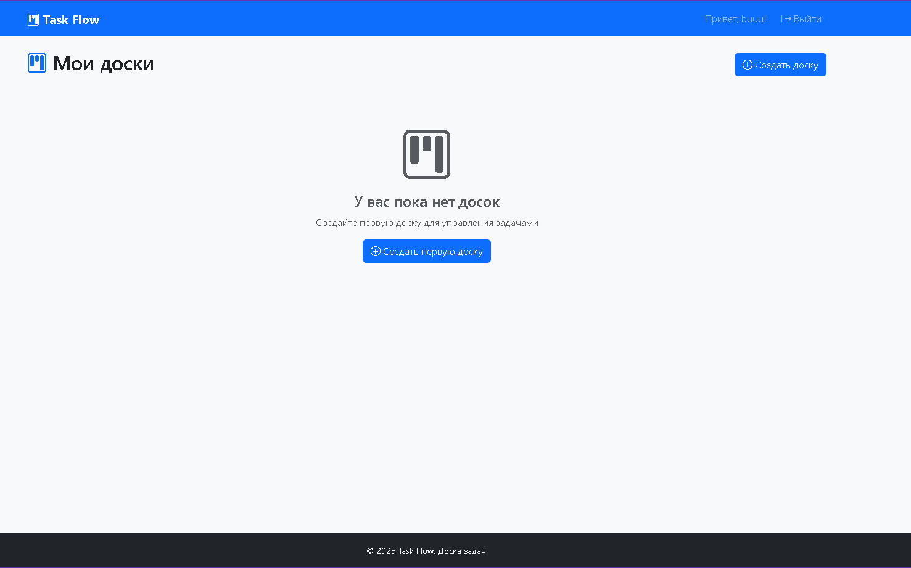
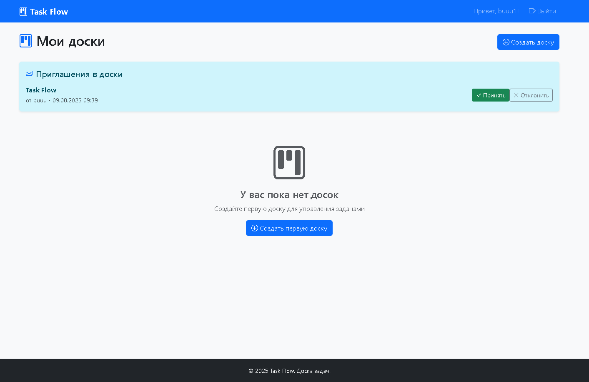
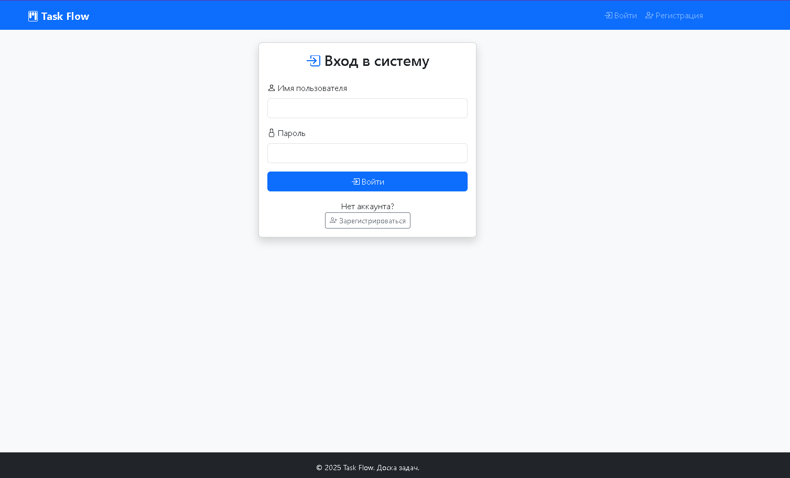
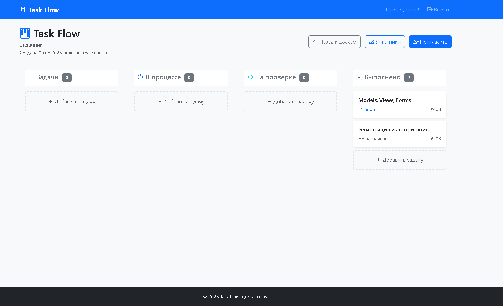
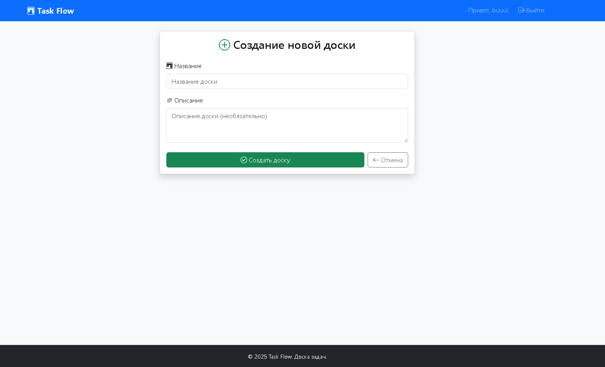
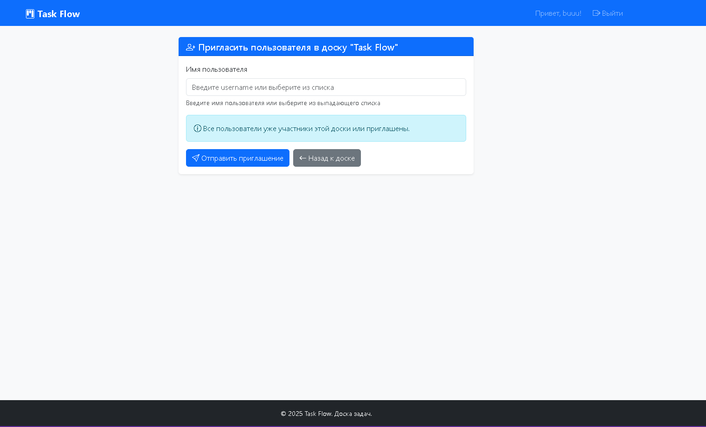

# Task Flow


Простая доска для управления задачами с синхронизацией между пользователями.

## 📸 Скриншоты

<div align="center">

### 🏠 Главная страница


*Список досок пользователя с приглашениями*

### 🔐 Аутентификация

*Простая форма входа*

### 📋 Доска

*Доска с drag & drop функциональностью*

### ➕ Создание доски

*Форма создания новой доски проекта*

### 👥 Приглашение участников

*Добавление участников по username*

</div>

## ✨ Основные возможности

### 🎯 **Управление проектами**
- 📋 Создание и удаление досок
- 👑 Роли владельца и участника
- 🔍 Просмотр списка всех проектов

### 🤝 **Командная работа**
- 👥 Приглашение пользователей по username
- ✅ Принятие/отклонение приглашений
- 📊 Просмотр участников проекта

### 📋 **Доска с колонками**
- 🏷️ 4 колонки статусов: Задачи → В процессе → На проверке → Выполнено
- 🖱️ Drag & Drop перемещение задач между колонками
- ➕ Быстрое создание задач в любой колонке
- 👤 Назначение исполнителей из участников

## 🚀 Статус проекта

### ✅ Реализовано
- **Django 4.2.7** проект с базовой настройкой
- **Структура приложений**:
  - `accounts` - управление пользователями и аутентификация
  - `boards` - управление досками и приглашениями
  - `tasks` - управление задачами
- **Модели данных**:
  - `Board` - доски проектов
  - `BoardMember` - участники досок с ролями
  - `BoardInvitation` - система приглашений пользователей
  - `Task` - задачи с 4 статусами (Задачи, В процессе, На проверке, Выполнено)
- **Аутентификация**: страницы логина и регистрации с Django Auth
- **Главная страница**: список досок пользователя с приглашениями
- **Интерфейс доски**: 4 колонки (Задачи, В процессе, На проверке, Выполнено)
- **Drag & Drop**: перемещение задач между колонками через AJAX
- **Управление участниками**: приглашение пользователей по username
- **CRUD операции**: создание и удаление досок, создание задач
- **Админ-панель** Django Admin
- **Безопасность**: SECRET_KEY в .env файле
- **Локализация** на русском языке

## 🛠️ Технологический стек

### 🖥️ **Backend**
- **Django 4.2.7** - фреймворк
- **SQLite** - база данных для разработки
- **Django ORM** - работа с моделями
- **Django Auth** - система аутентификации

### 🎨 **Frontend**  
- **HTML** - разметка
- **CSS** - кастомные стили
- **Bootstrap** - UI
- **JavaScript** - интерактивность и AJAX

### 🔧 **Дополнительные технологии**
- **python-dotenv** - управление переменными окружения
- **Bootstrap Icons** - иконки
- **Git** - контроль версий

## 📁 Структура проекта

```
Task-Flow/
├── taskflow/           # Настройки Django
├── accounts/           # Пользователи и аутентификация
├── boards/             # Управление досками и приглашениями
├── tasks/              # Управление задачами
├── templates/          # HTML шаблоны (base, boards, accounts)
├── static/            # CSS, JS файлы (main.css, main.js)
├── requirements.txt   # Зависимости
└── .env              # Секретные настройки
```

## 🚀 Установка и запуск

1. **Клонировать репозиторий**:
```bash
git clone https://github.com/QSnock/Task-Flow.git
cd Task-Flow
```

2. **Создать виртуальное окружение**:
```bash
python -m venv venv
source venv/bin/activate  # Linux/Mac
# или
venv\Scripts\activate  # Windows
```

3. **Установить зависимости**:
```bash
pip install -r requirements.txt
```

4. **Создать .env файл**:
```bash
SECRET_KEY=your-secret-key-here
```

5. **Выполнить миграции**:
```bash
python manage.py migrate
```

6. **Создать суперпользователя** (Опционально):
```bash
python manage.py createsuperuser
```

7. **Запустить сервер**:
```bash
python manage.py runserver
```

## 📋 Модели

### Board (Доска)
- Название и описание
- Владелец доски
- Даты создания и обновления

### BoardMember (Участник доски)
- Связь пользователь-доска
- Роль (Владелец/Участник)
- Дата добавления

### Task (Задача)
- Название и описание
- Принадлежность к доске
- Статус (todo/in_progress/review/done)
- Исполнитель и создатель
- Позиция

## 👨‍💻 Автор

**Евгений Сульжицкий** - [GitHub](https://github.com/QSnock)

### 🔗 Ссылки
- [VK](https://vk.com/idholleyyt)
- [YouTube](https://youtube.com/@QSnock)

---

⭐ Если вам понравился проект, поставьте звездочку!
